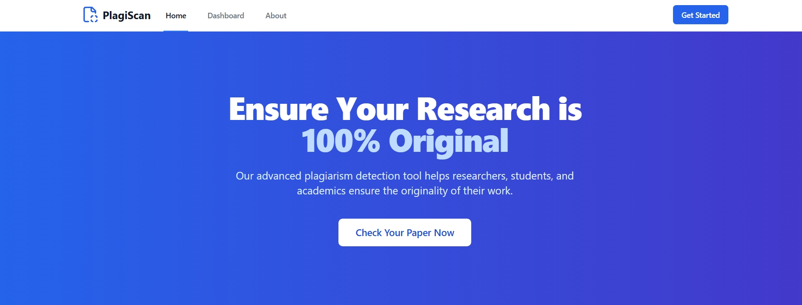
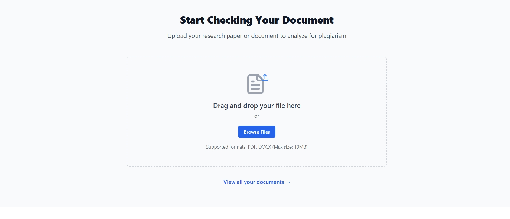
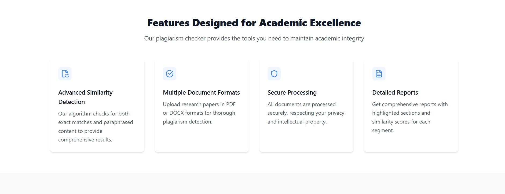

# 📄 PlagiScan

**PlagiScan** is an advanced plagiarism detection tool designed to assist researchers, students, and academics in verifying the originality of their research papers and academic work. Our mission is to promote academic integrity by providing a seamless, effective, and accessible plagiarism checking experience.

---

## 🚀 Features

- 🔍 Advanced plagiarism detection for research and academic content  
- 📚 Designed for researchers, students, and educators  
- 📖 Promotes proper citation and attribution  
- 🧠 Simple, clean dashboard and user interface  
- 🛠️ Backend integration ready for powerful analysis engines

---

## 🎯 My Mission

### Promoting Academic Integrity

PlagiScan was created to help ensure that academic content is original and properly cited. We believe in the importance of integrity and proper attribution in scholarly work.

---
## 📸 Project Screenshots

Here are some visuals showcasing the progress and features of the project:

### 🖼️ Homepage


### 🧩 Feature View


### 📊 UI


---

## 📦 Tech Stack

- **Frontend**: React.js 
- **Backend**: Node.js
- **Database**: MongoDB
- **Plagiarism Engine**: NLP techniques and API-based comparison //currently working on it.

---

## 🛠️ Installation & Setup

```bash
# Clone the repository
git clone https://github.com/your-username/plagiscan.git
cd plagiscan

# Install dependencies
npm install         # For Node projects
# or
pip install -r requirements.txt  # For Python projects

# Start the server
npm start           # or python app.py / flask run
